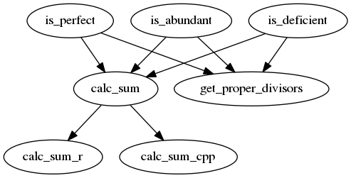

# Lesson 3

## Setup

 * Package name: `cirthree`
 * Documentation: roxygen2
 * Travis CI: enabled

### `.travis.yml`

```
language: r
cache: packages
```

### README.md

```
# cirthree

Lessen 3 of [collaboration_in_r](https://github.com/richelbilderbeek/collaboration_in_r).



Branch|[Travis](https://travis-ci.org)|[Codecov](https://www.codecov.io)
---|---|---
`master` |[](https://travis-ci.org/richelbilderbeek/cirthree)|[](https://codecov.io/github/richelbilderbeek/cirthree/branch/master)
`develop`|[](https://travis-ci.org/richelbilderbeek/cirthree)|[](https://codecov.io/github/richelbilderbeek/cirthree/branch/develop)
```

## Issues

### Become a collaborator

 * Difficulty: 1/10

Share @richelbilderbeek your GitHub username and he'll add you as a Collaborator.

### Add your branch

 * Difficulty: 1/10

Create a branch with your name at the GitHub website

### Show your branch's build status

 * Difficulty: 1/10

Create a branch with your name at the GitHub website.

Do this below the `develop` branch.

```
Branch|[](https://travis-ci.org)|[](https://www.codecov.io)
---|---|---
`master` |[](https://travis-ci.org/richelbilderbeek/cirthree)|[](https://codecov.io/github/richelbilderbeek/cirthree/branch/master)
`develop`|[](https://travis-ci.org/richelbilderbeek/cirthree)|[](https://codecov.io/github/richelbilderbeek/cirthree/branch/develop)
```

### Add `lintr` to Travis CI script

 * Difficulty: 1/10

To the `.travis.yml` script, add:

```
r_github_packages:
  - jimhester/lintr

after_success:
  - Rscript -e "lintr::expect_lint_free()"
```

### Add `covr` to Travis script

 * Difficulty: 1/10

To the `.travis.yml` script, add:

```
r_github_packages:
  - jimhester/covr

after_success:
  - Rscript -e "covr::codecov()"
```

### Add `goodpractice` to Travis script

 * Difficulty: 1/10

To the `.travis.yml` script, add:

```
r_github_packages:
  - MangoTheCat/goodpractice

after_success:
  - Rscript -e "goodpractice::gp()"
```

### Add @lintr-bot's guidance

 * Difficulty: 2/10

Add the following test to a file called `test-style.R` in the tests folder:

```
context("test-style")

test_that("package style", {
  lintr::expect_lint_free()
})
```

### Create `calc_sum_cpp` 1: use

 * Difficulty: 2/10

`calc_sum_cpp` is a C++ function to sum multiple values.

These are its tests:

```r
test_that("use", {

  skip("calc_sum_cpp: use")
  expect_equal(calc_sum_cpp(c()), 0)
  expect_equal(calc_sum_cpp(c(1)), 1)
  expect_equal(calc_sum_cpp(c(1, 2)), 3)
  expect_equal(calc_sum_cpp(c(1, 2, 3)), 6)
})
```

### Create `calc_sum_cpp` 2: abuse

 * Difficulty: 2/10

`calc_sum_cpp` is a C++ function to sum multiple values.

It should give a readable error if the user supplies incorrect input.

These are its tests:

```r
test_that("abuse", {

  skip("calc_sum_cpp: abuse")
  expect_error(calc_sum_cpp("nonsense"), "'values' must be numeric")
  expect_error(calc_sum_cpp(NA), "'values' must be numeric")
  expect_error(calc_sum_cpp(NULL), "'values' must be numeric")
  expect_error(calc_sum_cpp(c(1, "nonsense", 3)), "'values' must be numeric")
})
```

### Create `calc_sum_r` 1: use

 * Difficulty: 2/10

`calc_sum_r` is an R function to sum multiple values.

These are its tests:

```r
test_that("use", {

  skip("calc_sum_r: use")
  expect_equal(calc_sum_r(c()), 0)
  expect_equal(calc_sum_r(c(1)), 1)
  expect_equal(calc_sum_r(c(1, 2)), 3)
  expect_equal(calc_sum_r(c(1, 2, 3)), 6)
})
```

### Create `calc_sum_r` 2: abuse

 * Difficulty: 2/10

`calc_sum_r` is n R function to sum multiple values.

It should give a readable error if the user supplies incorrect input.

These are its tests:

```r
test_that("abuse", {

  skip("calc_sum_cpp: abuse")
  expect_error(calc_sum_r("nonsense"), "'values' must be numeric")
  expect_error(calc_sum_r(NA), "'values' must be numeric")
  expect_error(calc_sum_r(NULL), "'values' must be numeric")
  expect_error(calc_sum_r(c(1, "nonsense", 3)), "All values of 'values' must be numeric")
})
```

### Create `calc_sum` 1: use

Depends on:

 * [ ] `calc_sum_cpp`
 * [ ] `calc_sum_r`

 * Difficulty: 2/10

`calc_sum` is a function to sum multiple values,
which can run using C++ or R code.

These are its tests:

```r
test_that("use", {

  skip("calc_sum: use")
  values <- c()
  expect_equal(
    calc_sum(values = values, language = "C++"),
    calc_sum(values = values, language = "R")
  )

  values <- c(1)
  expect_equal(
    calc_sum(values = values, language = "C++"),
    calc_sum(values = values, language = "R")
  )

  values <- c(1, 2)
  expect_equal(
    calc_sum(values = values, language = "C++"),
    calc_sum(values = values, language = "R")
  )

  values <- c(1, 2, 3)
  expect_equal(
    calc_sum(values = values, language = "C++"),
    calc_sum(values = values, language = "R")
  )
})
```

### Create `calc_sum` 2: abuse

 * Difficulty: 2/10

`calc_sum` is a function to sum multiple values,
which can run using C++ or R code.

It should give a readable error if the user supplies incorrect input.

These are its tests:

```r
test_that("abuse", {

  skip("calc_sum: abuse")
  expect_error(calc_sum("nonsense", language = "C++"), "'values' must be numeric")
  expect_error(calc_sum("nonsense", language = "R"), "'values' must be numeric")

  expect_error(calc_sum(NA, language = "C++"), "'values' must be numeric")
  expect_error(calc_sum(NA, language = "R"), "'values' must be numeric")

  expect_error(calc_sum(NULL, language = "C++"), "'values' must be numeric")
  expect_error(calc_sum(NULL, language = "R"), "'values' must be numeric")

  expect_error(calc_sum(c(1, "nonsense", 3), language = "R"), "All values of 'values' must be numeric")
  expect_error(calc_sum(c(1, "nonsense", 3), language = "C++"), "'values' must be numeric")

  expect_error(calc_sum(c(1, 2), language = "X"), "'language' must be 'C++' or 'R'")
  expect_error(calc_sum(c(1, 2), language = NULL), "'language' must be 'C++' or 'R'")
  expect_error(calc_sum(c(1, 2), language = NA), "'language' must be 'C++' or 'R'")
  expect_error(calc_sum(c(1, 2), language = c()), "'language' must be 'C++' or 'R'")
})
```

### Create `get_proper_divisors` 1: use

 * Difficulty: 2/10

`get_proper_divisors` is a function to collect all proper divisors of a number
in one vector. A proper divisor `p` of a number `n` is a value less than `n`, 
for which `n % p == 0`.
For example, 6 has proper divisors 1, 2, 3.

It should do what a user expects it to do.

These are its tests:

```r
test_that("use", {

  skip("calc_squared: use")
  expect_equal(get_proper_divisors(1), c())
  expect_equal(get_proper_divisors(2), c(1))
  expect_equal(get_proper_divisors(3), c(1))
  expect_equal(get_proper_divisors(4), c(1, 2))
  expect_equal(get_proper_divisors(5), c(1))
  expect_equal(get_proper_divisors(6), c(1, 2, 3))
  expect_equal(get_proper_divisors(7), c(1))
  expect_equal(get_proper_divisors(8), c(1, 2, 4))
  expect_equal(get_proper_divisors(9), c(1, 2, 3))

})
```

### Create `get_proper_divisors` 2: abuse

 * Difficulty: 2/10

`get_proper_divisors` is a function to collect all proper divisors of a number
in one vector. A proper divisor `p` of a number `n` is a value less than `n`, 
for which `n % p == 0`.
For example, 6 has proper divisors 1, 2, 3.

It should give a readable error if the user supplies incorrect input.

These are its tests:

```r
test_that("abuse", {

  skip("calc_squared: abuse")
  expect_error(get_proper_divisors("nonsense"), "'n' must be numeric")
  expect_error(get_proper_divisors(NA), "'n' must be numeric")
  expect_error(get_proper_divisors(NULL), "'n' must be numeric")
  expect_error(get_proper_divisors(c(1, 2)), "'n' must be one numeric")
  expect_error(get_proper_divisors(-1), "'n' must be non-zero positive")
  expect_error(get_proper_divisors(0), "'n' must be non-zero positive")
})
```

### Create `is_perfect` 1: use

Depends on:

 * [ ] `calc_sum`
 * [ ] `get_proper_divisors`

 * Difficulty: 1/10

`is_perfect` is a function to determine if a number is a perfect number.
A perfect number has the sum of its proper divisor equal to itself.
For example, 6 has proper divisors 1, 2, 3. Because 1 + 2 + 3 == 6, 6 is
a perfect number.

:warning: Use `calc_sum` and `get_proper_divisors` to implement `is_perfect` :warning:

Pick freely which of the two languages of `calc_sum` to use by default.

```r
test_that("use", {

  skip("is_perfect: use")
  expect_false(is_perfect(-1))
  expect_false(is_perfect(0))
  expect_false(is_perfect(1))
  expect_false(is_perfect(2))
  expect_false(is_perfect(4))

  expect_true(is_perfect(6))
  expect_true(is_perfect(6, language = "C++"))
  expect_true(is_perfect(6, language = "R"))

  expect_false(is_perfect(10))
  expect_false(is_perfect(16))
  expect_true(is_perfect(24))

})
```

### Create `is_perfect` 2: abuse

Depends on:

 * [ ] `calc_sum`
 * [ ] `get_proper_divisors`

 * Difficulty: 2/10

`is_perfect` is a function to determine if a number is a perfect number.
A perfect number has the sum of its proper divisor equal to itself.
For example, 6 has proper divisors 1, 2, 3. Because 1 + 2 + 3 == 6, 6 is
a perfect number.

It should give a readable error if the user supplies incorrect input.

```r
test_that("abuse", {

  skip("is_perfect: abuse")

  expect_error(is_perfect("nonsense"), "'x' must be numeric")
  expect_error(is_perfect(NA), "'x' must be numeric")
  expect_error(is_perfect(NULL), "'x' must be numeric")
  expect_error(is_perfect(c(1, 2)), "'x' must be one numeric")

})
```


### Create `is_abundant` 1: use

Depends on:

 * [ ] `calc_sum`
 * [ ] `get_proper_divisors`

 * Difficulty: 1/10

`is_abundant` is a function to determine if a number is abundant number.
A number is abundant if the sum of its proper divisor exceeds itself.
For example, 24 is abundant, as its the proper divisors are 1, 2, 3, 4, 6, 8, and 12.
The sum of these is 36. Because 36 is more than 24, the number is abundant.

:warning: Use `calc_sum` and `get_proper_divisors` to implement `is_abundant` :warning:

Pick freely which of the two languages of `calc_sum` to use by default.

```r
test_that("use", {

  skip("is_abundant: use")
  expect_false(is_abundant(-1))
  expect_false(is_abundant(0))
  expect_false(is_abundant(1))
  expect_false(is_abundant(2))
  expect_false(is_abundant(4))
  expect_false(is_abundant(10))

  expect_true(is_abundant(12))
  expect_true(is_abundant(12, language = "C++"))
  expect_true(is_abundant(12, language = "R"))

  expect_false(is_abundant(16))
  expect_true(is_abundant(18))
  expect_false(is_abundant(32))
  expect_true(is_abundant(36))
})
```

### Create `is_abundant` 2: abuse

Depends on:

 * [ ] `calc_sum`
 * [ ] `get_proper_divisors`

 * Difficulty: 2/10

`is_abundant` is a function to determine if a number is abundant number.
A number is abundant if the sum of its proper divisor exceeds itself.
For example, 24 is abundant, as its the proper divisors are 1, 2, 3, 4, 6, 8, and 12.
The sum of these is 36. Because 36 is more than 24, the number is abundant.

It should give a readable error if the user supplies incorrect input.

```r
test_that("abuse", {

  skip("is_abundant: abuse")

  expect_error(is_abundant("nonsense"), "'x' must be numeric")
  expect_error(is_abundant(NA), "'x' must be numeric")
  expect_error(is_abundant(NULL), "'x' must be numeric")
  expect_error(is_abundant(c(1, 2)), "'x' must be one numeric")
})
```


### Create `is_deficient` 1: use

Depends on:

 * [ ] `calc_sum`
 * [ ] `get_proper_divisors`

 * Difficulty: 1/10

`is_deficient` is a function to determine if a number is deficient.
A number is deficient if the sum of its proper divisor is less than itself.
For example, 8 is deficient, as its the proper divisors are 1, 2, 4.
The sum of these is 7. Because 7 is less than 8, the number is deficient.

:warning: Use `calc_sum` and `get_proper_divisors` to implement `is_deficient` :warning:

Pick freely which of the two languages of `calc_sum` to use by default.

```r
test_that("use", {

  skip("is_deficient: use")

  expect_false(is_deficient(-1))
  expect_false(is_deficient(0))
  expect_true(is_deficient(1))
  expect_true(is_deficient(2))
  expect_true(is_deficient(3))
  expect_true(is_deficient(4))

  expect_true(is_deficient(5))
  expect_true(is_deficient(5, language = "C++"))
  expect_true(is_deficient(5, language = "R"))

  expect_true(is_deficient(7))
  expect_true(is_deficient(8))
  expect_false(is_deficient(12))
  expect_false(is_deficient(18))
  expect_true(is_deficient(19))

})
```

### Create `is_deficient` 2: abuse

Depends on:

 * [ ] `calc_sum`
 * [ ] `get_proper_divisors`

 * Difficulty: 2/10

`is_deficient` is a function to determine if a number is deficient.
A number is deficient if the sum of its proper divisor is less than itself.
For example, 8 is deficient, as its the proper divisors are 1, 2, 4.
The sum of these is 7. Because 7 is less than 8, the number is deficient.

It should give a readable error if the user supplies incorrect input.

```r
test_that("abuse", {

  skip("is_deficient: abuse")

  expect_error(is_deficient("nonsense"), "'x' must be numeric")
  expect_error(is_deficient(NA), "'x' must be numeric")
  expect_error(is_deficient(NULL), "'x' must be numeric")
  expect_error(is_deficient(c(1, 2)), "'x' must be one numeric")

})
```
